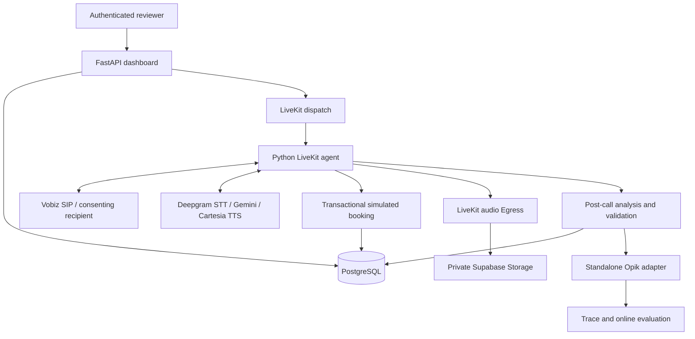

# Adit healthcare voice agent

An outbound healthcare voice agent using **LiveKit Agents and Python**. The dashboard accepts patient details and health metrics; the agent calls a consenting recipient, offers a simulated doctor consultation, and produces a recording, analysis, and automatically evaluated Opik trace.

**Dashboard → telephone call → appointment attempt → recording and analysis → Opik trace and online evaluation.**

## Reviewer entry points

- [Assignment requirements and proof](docs/requirements.md)
- [Verified real telephone call](docs/call-evidence.md)
- [Complete demonstration guide](docs/demo-guide.md)
- [Architecture and failure handling](docs/architecture.md)
- [Public deployment guide](docs/deployment.md)

**[Open the hosted dashboard](https://adit-healthcare-dashboard.onrender.com)** · **[GitHub checks](https://github.com/RahulRachhoya/adit-healthcare-voice-agent/actions/workflows/checks.yml)** · **[Deployment evidence](docs/deployment-evidence.md)**

The dashboard runs on Render Free, the voice worker on LiveKit Cloud, and the shared database on Supabase Free. Reviewer login credentials are shared privately. Calls require the operator login, an approved recipient, and explicit form submission. No call starts merely by opening the site.

Real recipient information, recordings, API keys, local environments, and private reports are excluded from this repository. Hosted login, protected API access, database access, and worker registration are verified; the recorded telephone evidence below is from the local deployment. A new call from the hosted dashboard has not been placed.

## Implementation status

| Requirement | Evidence |
|---|---|
| LiveKit outbound telephone agent | Real Vobiz call completed on September 15, 2026 |
| Supplied name, phone number, and biomarkers | Dashboard request is validated, persisted, and loaded by the worker |
| Health discussion and doctor consultation attempt | Verified call discussed supplied synthetic metrics and saved a simulated booking |
| Post-call analysis | Structured analysis checked against the authoritative booking |
| Recording and complete Opik trace | Actual 133.56-second audio, transcript, variables, tool results, and analysis verified |
| Automatic online evaluation | Real call scored `booking_outcome_correctness = 1.0` through Opik online scoring |
| Standalone Opik integration | One independent module accepts ordinary structured reports |
| Documentation and checks | Locked dependencies, migrations, tests, container builds, setup and deployment instructions |

The real call used trial credit with no payment. It encountered model rate limits, and analysis was recovered from saved evidence using the retry command. A final reviewer demonstration remains to be presented; the PDF does not prescribe a narrated-video format. See [limitations](docs/decisions-and-limitations.md).

Calls currently start immediately. Future telephone scheduling and additional latency improvements discussed during review are not implemented. Simulated doctor-appointment booking is implemented.

## Architecture and stack



The dashboard and worker run independently and share PostgreSQL. Closing the browser does not end a call. A booking succeeds only when saved in the database. Finalization retries do not redial.

| Component | Choice |
|---|---|
| Runtime | Python 3.12, uv, committed lockfile |
| Web application | FastAPI, Jinja2, plain JavaScript/CSS |
| Voice | LiveKit Agents; Deepgram Nova-3 STT; Cartesia Sonic-3 TTS |
| Dialogue / analysis | Separately configurable Gemini models |
| Database | PostgreSQL, SQLAlchemy, Alembic |
| Recording | Audio-only OGG Egress to private Supabase Storage |
| Observability | Opik Cloud and its built-in free judge |
| Telephone | Verified Vobiz SIP trial connection |
| Hosting | Render Free dashboard, LiveKit Cloud Build worker, Supabase Free database |
| Automation | GitHub Actions for checks, builds, and agent deployment |

GitHub Pages serves static sites; it cannot run this Python application. GitHub Actions runs checks and deployment jobs rather than permanently hosting the application. Hosting quotas, sleep behavior, and trial limitations are documented in [deployment](docs/deployment.md).

## Project structure

```text
.
├── README.md, pyproject.toml, uv.lock, .python-version
├── .env.example, .gitignore, .dockerignore
├── Dockerfile                 # LiveKit worker
├── Dockerfile.web             # FastAPI dashboard
├── compose.yaml               # Local PostgreSQL
├── render.yaml                # Free dashboard blueprint; no credentials
├── alembic.ini
├── src/adit_voice_agent/
│   ├── config.py, schemas.py, cli.py
│   ├── agent/                 # Voice lifecycle, tools, transcript conversion
│   ├── services/              # Calls, booking, recording, post-call processing
│   ├── integrations/          # Standalone opik_integration.py
│   ├── db/                    # Database models and sessions
│   ├── prompts/               # Versioned instructions
│   └── web/                   # Authentication, routes, templates, assets
├── migrations/versions/
├── examples/                  # Explicitly synthetic examples
├── evaluations/               # Rule, rubric, and labeled cases
├── scripts/
├── tests/
├── docs/
├── artifacts/README.md        # Actual call artifacts remain private
└── .github/workflows/
```

The committed `livekit.toml` identifies this hosted agent and contains no credentials. When deploying your own fork, generate configuration for your own LiveKit project. Operator commands are implemented once in `cli.py`; web routes delegate business logic to services.

## Local quick start

Prerequisites: uv, Docker, and eligible cloud accounts for real telephone testing. Start with calling disabled while configuring accounts.

From a **fresh checkout**, in PowerShell:

```powershell
uv sync --frozen
Copy-Item .env.example .env
docker compose up -d postgres
uv run adit-password
uv run python -c "import secrets; print(secrets.token_urlsafe(48))"
```

Save the password hash as `ADMIN_PASSWORD_HASH` and the random value as `SESSION_SECRET` in `.env`. The example points at the supplied local PostgreSQL service. Do not overwrite an existing configured `.env`.

```powershell
uv run alembic upgrade head
uv run adit-seed
uv run adit-check --database
uv run uvicorn adit_voice_agent.web.app:create_app --factory --host 127.0.0.1 --port 8000
```

Open `http://127.0.0.1:8000` and sign in as `operator` using your chosen password. **Needs setup** is expected until credentials are configured. See [setup](docs/setup.md) and the [environment reference](docs/configuration.md).

## Run a telephone demonstration

Configure LiveKit/SIP, Gemini, private recording storage, and Opik using [external services](docs/external-services.md). Both processes must use the same database and dispatch name. Start the worker in another terminal:

```powershell
uv run adit-agent download-files
uv run adit-agent dev
```

Do not run workers with the same dispatch name against different databases. The hosted deployment uses `adit-healthcare-cloud`, separate from the local worker.

Configure the online evaluation once:

```powershell
uv run adit-configure-evaluation
```

Save its returned ID as `OPIK_RULE_ID`. Verify available trial credit and the consenting recipient, then set `FREE_TRIAL_VERIFIED=true`, `LIVE_CALLS_ENABLED=true`, and the private `ALLOWED_PHONE_NUMBERS` in both services.

1. Enter synthetic patient information in the dashboard and review the metric values and dates.
2. Enter an approved, consenting recipient's full international number.
3. Start the call, answer the telephone, and accept or decline the simulated consultation.
4. Review the saved outcome, transcript, tool results, recording, and analysis.
5. Inspect the Opik trace and automatic evaluation.

Limits: one active call, up to 180 connected seconds, ten admitted attempts, no automatic redial, and no paid upgrades or automatic top-up. Example phone numbers are fictional and must not be dialed.

## Evidence and recovery

The saved appointment is authoritative. Audio remains private; the authenticated recording endpoint returns a temporary playback URL. Analysis, recording, export, and evaluation states are separate from the call outcome.

```powershell
uv run adit-retry CALL_ID
```

This resumes post-call processing without redialing or rebooking. Missing evidence cannot be replaced with invented text. See [Opik integration](docs/opik-integration.md), [evaluation](docs/evaluation.md), and [API contracts](docs/api.md).

## Quality checks and deployment

```powershell
uv run ruff check .
uv run pytest -q
uv run alembic check
docker build -f Dockerfile.web -t adit-web:check .
docker build -f Dockerfile -t adit-agent:check .
```

Ordinary tests use fake external services and never dial. PostgreSQL concurrency tests require a dedicated `TEST_DATABASE_URL`. The initial public commit passed both GitHub Actions jobs: lint/migrations/tests and clean Linux builds of both containers. [Current checks](https://github.com/RahulRachhoya/adit-healthcare-voice-agent/actions/workflows/checks.yml) report subsequent commits. Historical local verification passed 93 tests; a later focused check passed 69.

The checks workflow runs lint, migrations, tests, and both container builds. The agent-deployment workflow is manually triggered after initial cloud setup. Follow [deployment.md](docs/deployment.md) for service configuration, secrets, first deployment, redeployment, and recovery.

## Documentation

- [Requirements](docs/requirements.md) and [actual evidence](docs/call-evidence.md)
- [Architecture](docs/architecture.md) and [limitations](docs/decisions-and-limitations.md)
- [Local setup](docs/setup.md) and [public deployment](docs/deployment.md)
- [Configuration](docs/configuration.md) and [cloud accounts](docs/cloud-onboarding.md)
- [External services](docs/external-services.md)
- [API](docs/api.md), [Opik integration](docs/opik-integration.md), and [evaluation](docs/evaluation.md)
- [Testing](docs/testing.md) and [reviewer walkthrough](docs/demo-guide.md)
