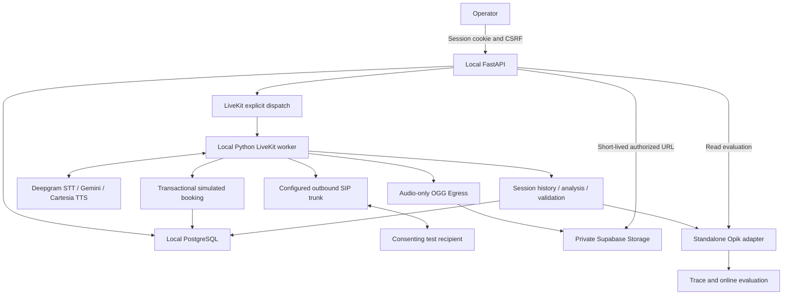

# Architecture

The web service accepts patient input and displays call evidence. A separate LiveKit process owns the conversation. Local development uses PostgreSQL in Docker; the reviewer deployment uses Render, LiveKit Cloud, and shared Supabase PostgreSQL. Closing the browser does not end the voice job. See [deployment.md](deployment.md) for the public topology and current verification requirements. The diagram below shows the local development topology.

## Package responsibilities

| Package | Responsibility |
|---|---|
| `agent` | Voice lifecycle, prompt, tool adapters, shared live/final SDK history normalization |
| `services/calls.py` | Global admission limit, request idempotency, dispatch reconciliation, persisted evidence |
| `services/booking.py` | Slot lookup, affirmative confirmation, atomic reservation |
| `services/recording.py` | Egress request, bounded completion checks, temporary playback URLs |
| `services/post_call.py` | Finalization lease, structured analysis, factual validation, export |
| `integrations/opik_integration.py` | All Opik imports and mapping; no application imports |
| `db` | SQLAlchemy tables and shared connection factory |
| `web` | Authentication, shared call-error response handler, HTTP contracts, templates, small browser interactions |
| `prompts` / `evaluations` | Versioned conversation instructions and independent scoring rules |

`schemas.py` contains the input, analysis and report models actually used by the application. Operator commands have one implementation in `cli.py`, registered as package commands in `pyproject.toml`.

## Call sequence

1. Validate the operator session, CSRF token, input, allowlist, and configuration.
2. Lock the single `control` row. Reuse an identical idempotency key or reserve one call and increment the attempt budget.
3. Persist the room identity, then request explicit agent dispatch. A timeout causes lookup of the original dispatch, never automatic redial.
4. The worker atomically claims the job once, connects the room, starts audio-only recording, then claims dialing once.
5. Dial via the configured SIP trunk. LiveKit binds the agent to the expected recipient identity.
6. Introduce the AI, disclose recording, confirm identity and willingness, relay only supplied values, and offer consultation.
7. Fetch slots, repeat the chosen local time and timezone, ask for an explicit “yes”, then execute the booking tool.
8. Save conversation and tool events as they arrive. On shutdown, reconstruct the transcript from final session history; interrupted speech remains marked.
9. Confirm room termination before releasing the active-call reservation. Finalization runs after the voice session.
10. Resolve and persist private recording completion, generate analysis and validate it against the saved booking, save the report, export and read back Opik, then poll its evaluation.

Voice and analysis use separately configurable Gemini models. The verified
configuration uses 3.6 Flash for voice and 3.5 Flash-Lite for analysis. A model
outage leaves the recording playable and the saved conversation available for
the existing retry command.

## Database and consistency

- `control`: single active call and persistent attempt counter.
- `calls`: request digest, room/dispatch, lifecycle, evidence, independent processing states, trace reference.
- `appointment_slots`: stable identifiers and UTC starts with named timezone.
- `bookings`: unique call ID and unique slot ID prevent repeat or conflicting reservations.

PostgreSQL row locks serialize admission and booking. Database constraints are the final protection against races. SQLite is an isolated local preview/test option, not a substitute for these concurrency checks. PostgreSQL migrations enable row-level security on application tables; no public Data API policies are created. Server database credentials must have the required owner/BYPASSRLS privileges.

## Failure behavior

| Failure | Behavior |
|---|---|
| Dispatch times out | Reconcile original room; retain reservation if unknown |
| Duplicate worker or tool execution | Atomic claim / existing booking returned |
| Slot already taken or past | Honest failed booking result |
| Database event write fails | Close conversation; recover final history; block analysis if final evidence cannot be saved |
| Recipient hangs up | Preserve available evidence; no success inferred from a hangup |
| Worker abruptly dies | Persisted partial events survive; reservation/evidence may require operator reconciliation |
| Room deletion uncertain | Hold admission reservation; operator uses End call |
| Analysis contradicts saved booking | Analysis marked failed; no export |
| Analysis provider unavailable | Preserve transcript, booking and playable recording; retry without dialing |
| Recording not ready | Report remains pending; no completed-call trace |
| Opik unavailable | Booking retained; export can be retried with stable trace identity |
| Evaluation delayed | Show pending/unavailable separately from call outcome |

Finalization uses a three-minute database lease. The retry command never calls dispatch or SIP. A crash that loses the final in-memory session history cannot be repaired by inventing transcript text; recover real evidence from LiveKit before marking it complete.

## Security boundaries

One operator account; Argon2 password hash; signed HttpOnly session cookie; SameSite Strict; CSRF validation; explicit hosts; CSP; bounded login throttling. The phone number is masked in dashboard responses and excluded from the model analysis/Opik variables. Recordings remain private; the trace includes the storage endpoint, bucket, object key and local authenticated playback page. This is a synthetic assessment application, not a clinical system.
